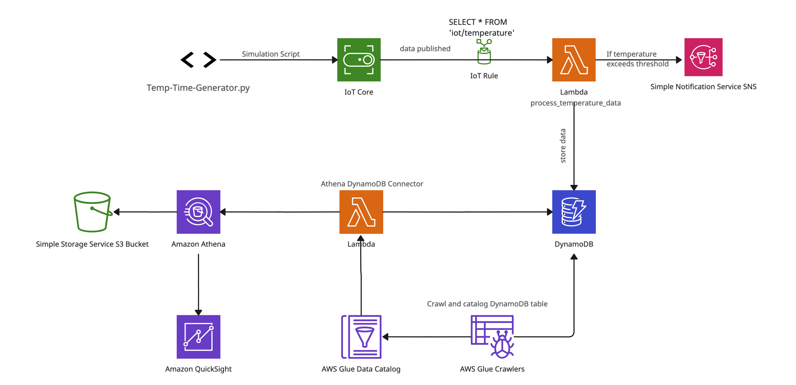

# IoT Temperature Monitoring System

This project demonstrates a comprehensive IoT temperature monitoring system using AWS services. The system collects temperature data from sensors (script), processes it, stores it in DynamoDB, analyzes it in Athena, and visualizes it in Amazon QuickSight.

## Table of Contents

- [Project Overview](#project-overview)
- [Architecture](#architecture)
- [Setup Instructions](#setup-instructions)
  - [AWS Configuration](#aws-configuration)
  - [Local Setup](#local-setup)
  - [Contact](#contact)

## Project Overview

This project simulates IoT temperature sensors and processes their data using AWS services. The data is stored in DynamoDB and visualized using Amazon QuickSight. The main components are:

- **AWS IoT**: For ingesting sensor data.
- **AWS Lambda**: For processing data and storing it in DynamoDB.
- **Amazon DynamoDB**: For storing temperature data.
- **AWS Glue**: For cataloging DynamoDB data.
- **Amazon Athena**: For querying DynamoDB data.
- **Amazon QuickSight**: For data visualization.

## Architecture



## Setup Instructions

### AWS Configuration

1. **Create and Configure IoT Thing**:
   - Create an IoT thing in the AWS IoT console.
   - Attach the necessary policy to allow data publishing.

2. **Deploy Lambda Functions**:
   - Upload the `ProcessTemperatureData.py` Lambda function.
   - Set up necessary IAM roles with appropriate permissions for DynamoDB, SNS, and CloudWatch.

3. **Set Up DynamoDB**:
   - Create a DynamoDB table named `TemperatureData` with appropriate attributes.

4. **Configure AWS Glue**:
   - Create a Glue database named `temperature_database`.
   - Create a Glue crawler to catalog the DynamoDB table.

5. **Athena Setup**:
   - Create an Athena data source using the Glue catalog.
   - Set the query results location in an S3 bucket.

6. **QuickSight Integration**:
   - Connect QuickSight to the Athena data source.
   - Create visualizations.

### Local Setup

1. **Clone the Repository**:
   ```bash
   git clone https://github.com/amirmalaeb/IoT-Temperature-Monitoring-System.git
   cd IoT-Temperature-Monitoring-System


2. **Install Dependencies:**
   - Ensure you have Python and pip installed.
   ```bash
   pip install boto3 paho-mqtt

4. **Configure and Run the Simulation Script**:
   - Update Temp-Time-Generator.py with your AWS IoT endpoint and certificates:
   ```bash
   broker = "your-iot-endpoint.amazonaws.com"
   port = 8883
   topic = "iot/temperature"
   client_id = "temperature_sensor"
   ca_path = "/path/to/AmazonRootCA1.pem"
   cert_path = "/path/to/certificate.pem.crt"
   key_path = "/path/to/private.pem.key"

  - Run the script to start publishing data to AWS IoT:
    python Temp-Time-Generator.py


5. **Analyzing Data in Athena

  - Configure Athena to Use Glue Data Catalog:
	•	Ensure Athena is configured to use the Glue Data Catalog as the data source.
  - Run SQL Queries:
  • In the Athena console, you can query the DynamoDB table cataloged by Glue. Example query:
   ```bash
   SELECT * FROM temperature_database.temperature_data LIMIT 10;


## Contact

For any inquiries or feedback, please contact Amir at amir.malaeb@gmail.com.
   
